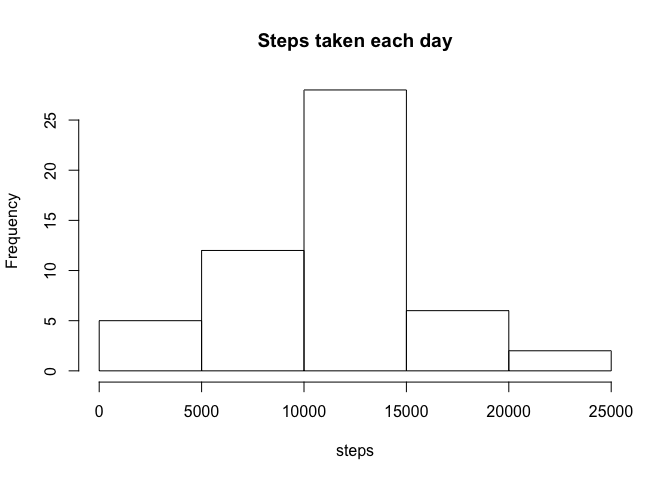
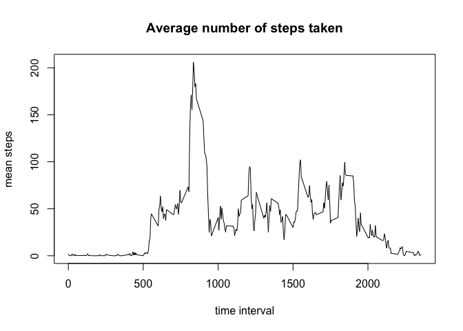
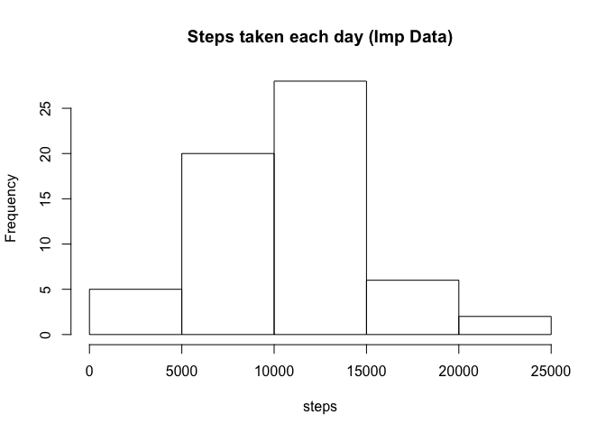
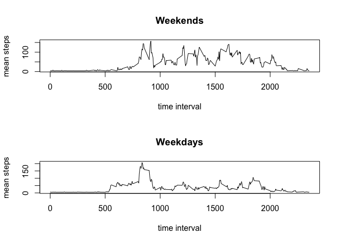

## Loading and preprocessing the data

```r
data <- read.csv("./activity.csv")
library(lubridate)
```

```
## 
## Attaching package: 'lubridate'
```

```
## The following object is masked from 'package:base':
## 
##     date
```

```r
library(dplyr)
```

```
## Warning: package 'dplyr' was built under R version 3.4.1
```

```
## 
## Attaching package: 'dplyr'
```

```
## The following objects are masked from 'package:lubridate':
## 
##     intersect, setdiff, union
```

```
## The following objects are masked from 'package:stats':
## 
##     filter, lag
```

```
## The following objects are masked from 'package:base':
## 
##     intersect, setdiff, setequal, union
```

## What is mean total number of steps taken per day?


```r
## Total number of steps taken per day
steps_day<-data.frame(tapply(data$steps,data$date,sum))
steps_day[,2] <- unique(data$date)

names(steps_day)<-c("steps","date")

hist(steps_day$steps,xlab="steps", main="Steps taken each day")
```

<!-- -->

```r
## Mean total number of steps taken per day
mean(steps_day$steps, na.rm = TRUE)
```

```
## [1] 10766.19
```

```r
## Median total number of steps taken per day
median(steps_day$steps, na.rm = TRUE)
```

```
## [1] 10765
```

## What is the average daily activity pattern?


```r
clean_data<-na.omit(data)

## Average number of steps taken per interval
steps_int<-as.data.frame(tapply(clean_data$steps, clean_data$interval, mean))
steps_int[,2]<-rownames(steps_int)
names(steps_int)<-c("mean", "int")

plot(steps_int$int, steps_int$mean, xlab="time interval", ylab="mean steps", type="l", main="Average number of steps taken")
```

<!-- -->

```r
## 5-minute interval which contains maximum amount of steps
as.numeric(steps_int[which.max(steps_int$mean),2])
```

```
## [1] 835
```

## Imputing missing values


```r
## Total number of missing values
sum(is.na(data$steps))
```

```
## [1] 2304
```

```r
## Impute the data
imp_data<-data
imp_data$steps[is.na(imp_data$steps)]<-median(steps_int$mean)

## Total number of steps taken each day
steps_day2<-data.frame(tapply(imp_data$steps,imp_data$date,sum))
steps_day2[,2] <- unique(imp_data$date)

names(steps_day2)<-c("steps","date")
hist(steps_day2$steps, xlab="steps", main="Steps taken each day (Imp Data)")
```

<!-- -->

```r
## Mean total number of steps taken per day

mean(steps_day2$steps)
```

```
## [1] 10642.7
```

```r
## Median total number of steps taken per day

median(steps_day2$steps)
```

```
## [1] 10395
```

## Are there differences in activity patterns between weekdays and weekends?


```r
imp_data$date<-ymd(imp_data$date)
```

```
## Warning in as.POSIXlt.POSIXct(x, tz): unknown timezone 'zone/tz/2017c.1.0/
## zoneinfo/Asia/Hong_Kong'
```

```r
dayofweek <- as.data.frame(weekdays(imp_data$date))
new_data <- cbind(imp_data, dayofweek)

wkends<-filter(new_data, dayofweek=="Saturday" | dayofweek=="Sunday")
wkends_int<-as.data.frame(tapply(wkends$steps, wkends$interval, mean))
wkends_int[,2]<-rownames(wkends_int)
names(wkends_int)<-c("mean", "int")

wkdays<-filter(new_data, dayofweek!="Saturday" & dayofweek!="Sunday")
wkdays_int<-as.data.frame(tapply(wkdays$steps, wkdays$interval, mean))
wkdays_int[,2]<-rownames(wkdays_int)
names(wkdays_int)<-c("mean", "int")

par(mfrow=c(2,1))
plot(wkends_int$int, wkends_int$mean, xlab="time interval", ylab="mean steps", main="Weekends", type="l")
plot(wkdays_int$int, wkdays_int$mean, xlab="time interval", ylab="mean steps", main="Weekdays", type="l")
```

<!-- -->


